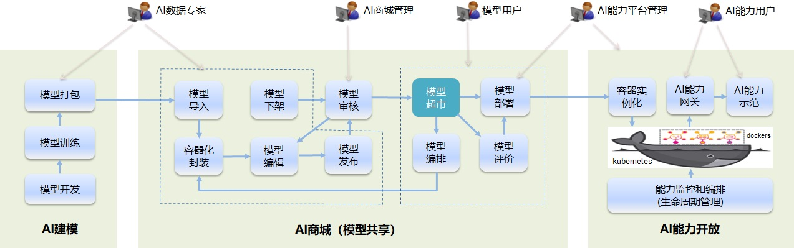

# 

    中国联通网络技术研究院
    2019年6月

---

## 平台简介

**CubeAI ★ 智立方** 是基于 [Linux深度学习基金会开源项目Acumos](https://www.acumos.org) 的设计理念，由中国联通网络技术研究院完全自主开发的集AI模型构建、模型共享（AI商城）和能力开放等功能于一体的开源AI网络平台。

平台目前提供AI模型打包、模型导入、容器化封装、模型编排、模型发布、模型搜索、模型部署、AI能力开放、开放能力编排、能力演示等功能，支持AI模型的docker容器化封装和微服务化部署。

CubeAI致力于在AI算法开发者和AI模型的实际使用者之间架设一条互通的桥梁，开发者无需关心具体的部署环境，最终用户无需了解AI算法的具体实现，从而使得开发者和用户能够各自集中精力于自己最擅长的领域，进而加速AI创新进程，方便AI算法从设计、开发到投入实际应用的整个过程。

## 系统架构

## 软件架构

## 开发环境

- 操作系统

    - Linux，建议Ubuntu 16.04 LTS
    
- 版本管理

    - git
      
- Java JDK

    - 安装

            # apt install openjdk-8-jdk

    - 配置环境变量： 

            export JAVA_HOME=/usr/lib/jvm/java-1.8.0-openjdk-amd64
            export PATH=$PATH:$JAVA_HOME/bin:$JAVA_HOME/jre/bin
        
 - Java build工具
 
    - Maven

    - 安装
    
            # apt-get install maven
            
    - 看maven版本号
    
            # mvn --version
            
    - 配置本地仓库
    
        Maven缺省使用当前用户登录目录下的.m2目录作为本地仓库。
        
- Node.js

    - 从 https://nodejs.org/en/download/ 下载相应版本，拷贝至/opt。
    
    - 解压，创建符号连接（用实际版本号替换以下版本号）：
    
            cd /opt
            # tar -xvf node-v8.10.0-linux-x64.tar.xz 
            # ln -s node-v8.10.0-linux-x64 nodejs
            # ln -s /opt/nodejs/bin/node /usr/bin/node
            # ln -s /opt/nodejs/bin/npm /usr/bin/npm
            # node -v
            
- 前端build工具

    - Yarn
    
    - 安装

            # curl -sS https://dl.yarnpkg.com/debian/pubkey.gpg | apt-key add -
            # echo "deb https://dl.yarnpkg.com/debian/ stable main" | tee /etc/apt/sources.list.d/yarn.list
            # apt-get update
            # apt-get install yarn
        
- 微服务代码脚手架工具

    - [JHipster](https://www.jhipster.tech)
    
    - 安装

            # yarn global add yo
            # yarn global add generator-jhipster

- Docker

    - 卸载旧版本（如果非初次安装）
    
            # apt-get remove docker docker-engine docker.io
    
    - 配置仓库
    
        - 更新apt-get包索引
    
                apt-get update
                
        - 安装软件包使apt可使用HTTPS:
    
                # apt-get install  apt-transport-https  ca-certificates  curl  software-properties-common
    
        - 添加Docker官方GPG key:
    
                # curl -fsSL https://download.docker.com/linux/ubuntu/gpg | apt-key add -
    
        - 验证指纹，是否有 9DC8 5822 9FC7 DD38 854A E2D8 8D81 803C 0EBF CD88
    
                # apt-key fingerprint 0EBFCD88

        - Set up the stable repository:
    
                # add-apt-repository  "deb [arch=amd64] https://download.docker.com/linux/ubuntu  $(lsb_release -cs)  stable"
    
    - 安装DOCKER CE
  
            # apt-get update
            # apt-get install docker-ce
    
    - 安装docker-compose
    
            # apt-get install docker-compose
            
    - 验证安装成功：
    
            # docker run hello-world
            
- 集成开发环境

    - 建议： Idea IntelliJ
      
## 安装、开发和部署

1. 代码下载

        # git clone https://github.com/cube-ai/cubeai.git
        
2. 开发

    - 参照docker/dev文件夹下的README文档，拉起平台开发所需依赖的所有基础微服务。
    
    - 参照uaa、gateway、umm、umu、umd、ability等文件夹下的README文档，分别进行各微服务的开发调试。
    
3. 部署

    - 参照docker/prod文件夹下的README文档，对整个平台运行所需要的所有微服务进行部署。
    
